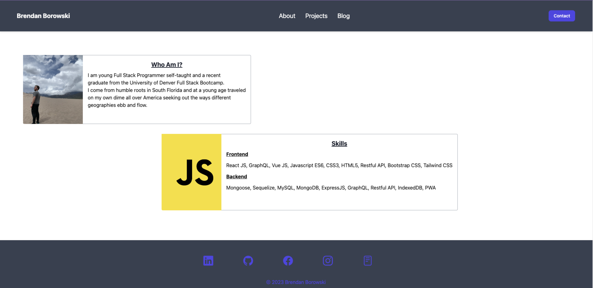
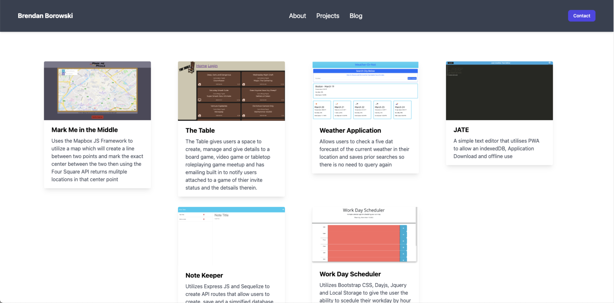
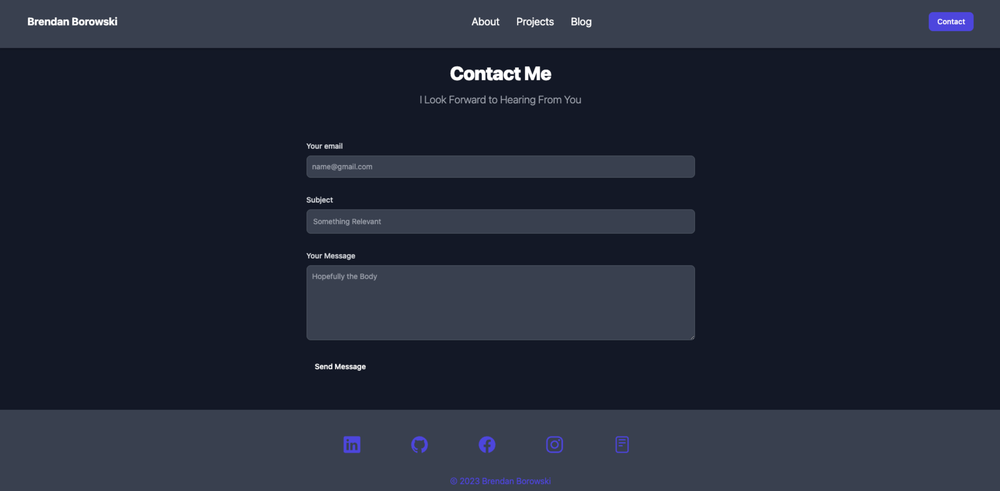

# react-portfolio

## Description

My React Portfolio is designed solely to show off what I can do using the react js library and tailwind css framework.

I think the thing I took away most from this experience was learn the css library you want to use first beofre picking it. Then structure in react is king.

## Installation

- To install my react portfolio simply pull the SSH Link from the bright green code button in GitHub.
- Open up your terminal on your local machine and naviage to a directory you would like to store the code for this in type git clone then paste the SSH Link and hit enter.
- Once done you will have the full repo then it is just a matter of changing directories to react portfolio and use your preffered method for opening it in a code editor.

## Usage

The portfolio will open to the about page by default which is shown below:

You can then click through the navigation to the projects tab and click into any of the cards seen in the screenshot below to see the live app

If you'd like to get in touch with me simply click on the contact button on the right of the navigation bar and the form below will show up.
It is linked to emailJS and fully works 

For future development I have a blog page that will use a mongoose db and a minimal graphql api to function 

## License

MIT License

## Features

- Navigates to About Me page on start saying a little blurb about me and my skills in programming

- Allows you to use react router dom to navigate through the single page application

- Has a projects page that showcases six deployed projects in cards that are generated by a map function. All cards link to the associated live links.

- Has the begginings of a blog page where I will add blogs and insights about coding and my life as I grow and develop

- Has a contact page that allows the user to type in their email, a subject and a message and using emailjs it sends to me

- Is reactive to any page size and has a built in menu just for mobile

- Can click on links in the footer to go to my LinkedIn, Github, Facebook, Instagram and my Resume

